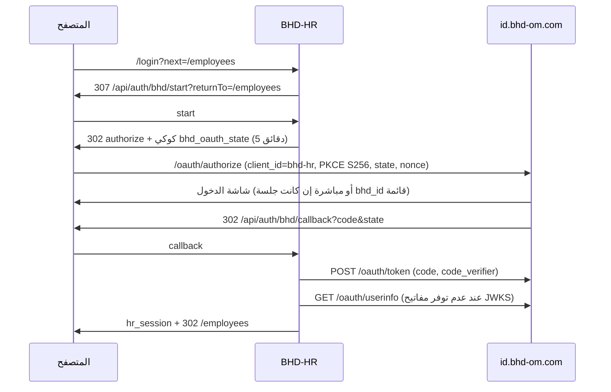

# المرجع التقني — BHD-HR

كل ما يحتاجه المطوّر لفهم النظام وتشغيله وصيانته وتطويره. دليل الاستخدام في [`BHD-HR-USER-GUIDE.md`](./BHD-HR-USER-GUIDE.md)، والدخول الموحّد في [`BHD-HR-SSO-INSTALL.md`](./BHD-HR-SSO-INSTALL.md).

---

## 1. التقنيات

| الطبقة | التقنية |
|---|---|
| الإطار | Next.js 15 (App Router، Server Components، Server Actions) |
| الواجهة | React 19، TypeScript 5، Tailwind CSS v4، أيقونات `lucide-react` |
| الخط والهوية | IBM Plex Sans Arabic، ألوان BHD (`#092d24` حبر، `#075c45` زمردي، `#fbfaf7` رملي، حدود `#d7e2dc`) |
| قاعدة البيانات | PostgreSQL على Neon عبر Prisma 6 — قاعدة مستقلة باسم `bhd_hr` على خادم Neon نفسه الذي تستخدمه ONE-BHD (قاعدة ONE-BHD اسمها `neondb` ولا يلمسها هذا النظام) |
| الملفات | تُخزَّن داخل قاعدة البيانات في جدول `StoredFile` (لأن الاستضافة بلا قرص دائم)، وتُخدَم عبر `/files/[name]` بعد التحقق من الجلسة. الحد 4 ميغابايت للملف |
| الهوية | OIDC مع `https://id.bhd-om.com` (PKCE S256)، مكتبة `jose` |
| الاستضافة | Vercel — المشروع `bhd-hr`، الرابط `https://bhd-hr.vercel.app`، ومربوط بمستودع GitHub فيُنشر تلقائياً عند كل دفع إلى `main` |
| التشغيل المحلي | Node.js ≥ 20، `npm run dev` (يتصل بقاعدة Neon نفسها) |

لا توجد خدمات خارجية أخرى: لا طوابير، لا مدفوعات، لا بريد.

---

## 2. بنية المجلدات

```
prisma/
  schema.prisma          نموذج البيانات
  seed.ts                إنشاء المنشأة والمسؤول الأول (admin@bhd.local / admin123)
public/brand/            شعار BHD الرسمي (svg)
docs/                    هذا التوثيق + مستندات ONE-BHD المرجعية
src/
  app/
    (app)/               الصفحات الداخلية (تتطلب دخولاً) + layout فيه الرأس والمشغّل والفوتر
    (print)/             صفحات الطباعة (قسيمة، إيصال، كشف مسير، كشف حساب، جهات الاتصال)
    api/auth/            start / callback / logout / admin-entry للدخول الموحّد
    files/[name]/        تقديم الملفات المرفوعة بعد التحقق
    login/               غلاف الدخول + دخول الطوارئ المحلي
    pending/             صفحة «بانتظار التفعيل»
  components/
    bhd/                 BhdAppSwitcher و BhdAppIcon (منسوخان من ONE-BHD) و site-footer
    ...                  النماذج، الشريط الجانبي، المطبوعات، عناصر الواجهة
  lib/
    bhd/apps.ts          كتالوج تطبيقات BHD المجمّد — منسوخ حرفياً، لا يُعدّل هنا
    bhd/identity.ts      إعدادات OIDC، PKCE، تبديل الرمز، التحقق من id_token
    auth.ts              جلسة المنتج، الأدوار، requireUser / requireWriter
    salary.ts payroll.ts حساب الراتب والخصم
    leave.ts             أرصدة الإجازات وتنبيهاتها
    alerts.ts            توليد التنبيهات
    calendar.ts          أحداث التقويم والتذكيرات
    contacts.ts          جهات الاتصال للعرض والطباعة
    i18n.ts lang.ts      الترجمة (عربي / إنجليزي)
  server/                Server Actions لكل عملية كتابة
```

---

## 3. نموذج البيانات

| الجدول | الغرض | أهم الحقول |
|---|---|---|
| `Company` | المنشأة وإعدادات النظام | الاسم، العملة، `salaryDays`، أيام تنبيه المستندات، `payDay`، `leaveWarningDays` |
| `User` | مستخدمو النظام | `email` (فريد)، `password` (scrypt أو فارغ لحسابات BHD)، `role`، `bhdSub` (فريد)، `picture`، `lastLoginAt` |
| `Employer` | الكفلاء وأصحاب العمل | `kind` (COMPANY / PERSON)، الاسم، الهاتف، البريد، الشعار |
| `Employee` | الموظفون | البيانات الشخصية، الوثائق وتواريخ انتهائها، الوظيفة، الحالة، أرصدة الإجازات، مكوّنات الراتب، `employerId` |
| `EmployeeDocument` | المستندات الإضافية | النوع، الرقم، الانتهاء، `fileUrl` |
| `Attendance` | يوم غياب / إجازة | `date` (يوم واحد لكل صف، فريد مع الموظف)، `type`، `deductsSalary`، `balanceKey`، `groupId` يجمع أيام الفترة الواحدة |
| `LeaveCredit` | إضافة رصيد يدوية | `balanceKey`، `days`، السبب |
| `Salary` | راتب شهر لموظف | لقطة كاملة للراتب والأسماء وقت الإنشاء، الخصومات، الصافي، حالة الصرف، `receiptNo` (فريد) |
| `Reminder` | تذكيرات التقويم | العنوان، التاريخ، التكرار (NONE / MONTHLY / YEARLY)، موظف اختياري، `done` |
| `AuditLog` | سجل العمليات | المستخدم، الموظف، الإجراء، الرسالة |
| `StoredFile` | الملفات المرفوعة (مستندات وشعارات) | `name` (فريد، يظهر في الرابط `/files/<name>`)، `mime`، `size`، `data` (البايتات) |

**التواريخ** تُخزّن عند الظهر بتوقيت UTC وتُقرأ بدوال `getUTC*` حتى لا ينزاح اليوم بسبب فرق التوقيت.

**الحذف المتسلسل:** حذف موظف يحذف حضوره ومستنداته ورواتبه وتذكيراته. سجلات `AuditLog` لا تُحذف تلقائياً.

---

## 4. القواعد الحسابية

```
الإجمالي     = الأساسي + السكن + النقل + البدلات الأخرى
قيمة اليوم   = الإجمالي ÷ salaryDays (افتراضياً 30)
خصم الغياب   = قيمة اليوم × أيام الغياب   (نصف يوم = 0.5)
الصافي       = الإجمالي − خصم الغياب − الخصومات الأخرى
```

كل المبالغ تُقرّب إلى 3 خانات عشرية (`round3`).

**أرصدة الإجازات** لكل نوع (`annual`، `sick`، `compensatory`، `other`):

```
المتبقي = المستحق في ملف الموظف + الإضافات (LeaveCredit) − المستخدم (Attendance)
```

**مستويات التنبيه** (`leaveWarnings`):
- `exceeded`: المتبقي أقل من صفر.
- `exhausted`: المتبقي صفر وقد استُخدم شيء.
- `low`: المتبقي بين 1 و`leaveWarningDays`، والرصيد الكلي أكبر من الحد.

تسجيل إجازة تتجاوز الرصيد يتطلب `allowOverdraft=1` من النموذج، ويُكتب التجاوز في `AuditLog`.

---

## 5. المصادقة والصلاحيات

### جلسة المنتج
- الكوكي `hr_session` = `userId.HMAC-SHA256(AUTH_SECRET)`، وهي HttpOnly وSameSite=Lax وHost-only، وSecure على الإنتاج.
- **سياسة BHD:** مدتها 400 يوم، ولا تنتهي بالخمول، ولا تُجدَّد عند القراءة؛ تُكتب فقط عند الدخول وتُمسح عند الخروج. لا KeepAlive، ولا `router.refresh()` عند عودة التبويب، ولا جوجل داخل المنتج.
- على الإنتاج يرفض النظام العمل بدون `AUTH_SECRET`.
- على الإنتاج (`NODE_ENV=production`) لا تعمل كلمة المرور الافتراضية: أي حساب محلي ما زال `mustChangePassword` يُرفض. الدخول الطبيعي على النسخة المنشورة يكون عبر حساب BHD الموحّد.

### الدخول الموحّد (OIDC)



| الملف | العمل |
|---|---|
| `api/auth/bhd/start` | يولّد `state` و`nonce` و`verifier`، يحفظها في `bhd_oauth_state`، ويحوّل إلى `authorize` |
| `api/auth/bhd/callback` | يطابق `state`، يبدّل الرمز من الخادم، يتحقق من `id_token`، يربط المستخدم، ويضع الجلسة |
| `api/auth/bhd/logout` | يمسح الجلسة ثم يحوّل إلى `end-session` على الهوية |
| `api/auth/admin-entry` | دخول الإدارة: يفتح `/settings` عبر الهوية (لا يرسل إلى كلمة المرور المحلية) |
| `login/page.tsx` | غلاف: يحوّل إلى `start` إلا مع `?local=1`؛ و`local=1` مع `next=/settings` أو `/admin` يذهب إلى `admin-entry` |

**التحقق من `id_token`:** أولاً RS256 من `/oauth/jwks.json`؛ ثم HS256 إن وُجد `BHD_IDENTITY_TOKEN_SECRET`؛ وإلا `/oauth/userinfo` بالـ access token مع فحص `iss` و`aud` و`exp` و`nonce` من الرمز ومطابقة `sub`. يُشترط `email_verified === true`. الهوية حالياً تنشر `{"keys":[]}` فيُستخدم مسار `userinfo`.

**ربط المستخدم:**
1. بالـ `bhdSub`.
2. بالبريد الموثّق، مع الاحتفاظ بالدور.
3. مستخدم جديد بدور `ADMIN` إن كان بريده في `BHD_ADMIN_EMAILS`، وإلا `PENDING`.

### الأدوار

| الدور | `requireUser` | `requireWriter` |
|---|---|---|
| `ADMIN` | ✓ | ✓ |
| `VIEWER` | ✓ | ✗ (رسالة «للعرض فقط») |
| `PENDING` | تحويل إلى `/pending` | ✗ |

كل صفحة داخلية وكل صفحة طباعة وكل ملف مرفوع يمر عبر `requireUser`، وكل عملية كتابة عبر `requireWriter`.

---

## 6. متغيرات البيئة

انسخ `.env.example` إلى `.env`. الملف `.env` لا يُرفع إلى Git.

| المتغير | إلزامي | الوصف |
|---|---|---|
| `DATABASE_URL` | نعم | رابط Postgres عبر مجمّع الاتصالات (مضيف `...-pooler...neon.tech`، قاعدة `bhd_hr`) |
| `DATABASE_URL_UNPOOLED` | نعم | رابط Postgres المباشر (المضيف نفسه بدون `-pooler`)، يستخدمه `prisma db push` |
| `AUTH_SECRET` | على الإنتاج | سر توقيع جلسة المنتج (نص عشوائي طويل). سر Vercel مختلف عن السر المحلي |
| `APP_ORIGIN` | على الإنتاج | الأصل العام، حالياً `https://bhd-hr.vercel.app` |
| `BHD_IDENTITY_ISSUER` | لا | افتراضياً `https://id.bhd-om.com` |
| `BHD_OAUTH_CLIENT_ID` | للدخول الموحّد | `bhd-hr`. فارغ = دخول محلي فقط |
| `BHD_OAUTH_CLIENT_SECRET` | لا | يُرسل إن وُجد؛ الهوية تقبل PKCE وحده لعملاء المنظومة |
| `BHD_OAUTH_REDIRECT_URI` | لا | افتراضياً `{الأصل}/api/auth/bhd/callback` |
| `BHD_ADMIN_EMAILS` | لا | بريد (أو أكثر بفواصل) يصبح مسؤولاً عند أول دخول موحّد |
| `BHD_IDENTITY_TOKEN_SECRET` | لا | للتحقق HS256 إن وفّرته الهوية |

---

## 7. التشغيل والصيانة

```bash
npm install          # يشغّل prisma generate تلقائياً
npm run db:setup     # لقاعدة جديدة فارغة فقط: إنشاء الجداول والمسؤول الأول
npm run dev          # http://localhost:3000
```

> التشغيل المحلي يتصل بقاعدة Neon نفسها التي يستخدمها الموقع المنشور، فأي تعديل محلي يظهر على الإنتاج فوراً.

### النشر على Vercel

- المشروع `bhd-hr` مربوط بمستودع `ainoamn/BHD-HR`. **كل `git push` إلى `main` يبني وينشر على الإنتاج تلقائياً.** سكربت البناء `prisma generate && next build`.
- متغيرات البيئة مضبوطة في Vercel (Settings → Environment Variables) للبيئات الثلاث: `DATABASE_URL`، `DATABASE_URL_UNPOOLED`، `AUTH_SECRET`، `APP_ORIGIN`، `BHD_IDENTITY_ISSUER`، `BHD_OAUTH_CLIENT_ID`، `BHD_OAUTH_REDIRECT_URI`، `BHD_ADMIN_EMAILS`. غياب `DATABASE_URL` أو `AUTH_SECRET` يُظهر «Application error: a server-side exception».
- لا تنشر من سطر الأوامر (`vercel deploy`) إلا عند الضرورة؛ الملف `.vercelignore` يمنع رفع `.env` وملفات القواعد والنسخ الاحتياطية، لكن النشر عبر Git هو الطريق المعتمد.
- Vercel يحدّ جسم الطلب بـ 4.5 ميغابايت، لذلك حد رفع الملف 4 ميغابايت (`MAX_UPLOAD_BYTES`) و`serverActions.bodySizeLimit` = `4.5mb`.
- عند إضافة نطاق جديد (مثل `hr.bhd-om.com`): أضفه في Vercel، وحدّث `APP_ORIGIN` و`BHD_OAUTH_REDIRECT_URI`، وتأكد أن رابطي `callback` والخروج مسجّلان للعميل `bhd-hr` في `app/lib/identity/clients.ts` في ONE-BHD.

**تعديل نموذج البيانات:**
1. أوقف الخادم المحلي (عملية node) على Windows.
2. خذ نسخة احتياطية (انظر أدناه).
3. `npx prisma db push` ثم `npx prisma generate`، ثم ادفع الكود.

**النسخ الاحتياطي:** Neon يحتفظ بسجل استرجاع زمني (Point-in-time restore) من لوحته. للنسخة اليدوية: `pg_dump "<DATABASE_URL_UNPOOLED>" > bhd_hr-YYYYMMDD.sql`. لا ترفع أي نسخة إلى Git. نسخ SQLite القديمة (`prisma/*.db`) باقية محلياً للرجوع فقط، ومستثناة من Git لأنها بيانات شخصية.

**الأسرار:** `.env` و`.env.*` (عدا `.env.example`) مستثناة من Git ومن رفع Vercel.

**الفحص قبل أي دمج:**

```bash
npx tsc --noEmit
```

---

## 8. توافق مستندات ONE-BHD

| المستند | التطبيق هنا |
|---|---|
| `BHD-PRODUCT-SSO-ADMIN.md` | start / callback / logout / admin-entry، غلاف `/login`، `bhdSub`، رابط الإدارة في الفوتر |
| `BHD-IDENTITY-SSO.md` | OIDC + PKCE S256، `state` و`nonce`، كوكيز Host-only، `email_verified`، لا مفاتيح في المتصفح |
| `BHD-SESSION-POLICY.md` | 400 يوم، بلا خمول ولا KeepAlive ولا جوجل محلي، لا `Set-Cookie` عند القراءة |
| `BHD-APP-SWITCHER.md` | `apps.ts` و`BhdAppIcon` و`BhdAppSwitcher` منسوخة حرفياً (تغيير مسار الاستيراد فقط)، في الرأس بجانب زر الحساب |
| `BHD-UNIFIED-LOGIN-AND-APPS.md` §0.1 و§0.5 | الألوان والخط والحدود؛ فوتر «برامجنا» والروابط ورابط الإدارة |
| `BHD-BRAND-IDENTITY.md` | الشعار الرسمي بنسخة الحبر في الواجهة والنسخة الفاتحة في الفوتر |

**ما يبقى قراراً في ONE-BHD:** إضافة BHD-HR إلى الكتالوج المجمّد `apps.ts` (فيظهر في مشغّل كل المنتجات) وقلب `mode` إلى `sso`. هذا لا يُعدّل من هذا المستودع.

---

## 9. سجل التغييرات

| التاريخ | التغيير |
|---|---|
| 2026-10-08 | النشر على Vercel: الانتقال من SQLite إلى PostgreSQL (Neon، قاعدة `bhd_hr`)، تخزين الملفات في `StoredFile`، بحث غير حساس لحالة الأحرف، متغيرات البيئة على Vercel، `.vercelignore`، تسجيل `bhd-hr.vercel.app` في ONE-BHD. نُقلت كل البيانات الحقيقية من SQLite |
| 2026-10-08 | الدخول الموحّد BHD، سياسة الجلسة، المشغّل، الفوتر، الهوية البصرية، إدارة المستخدمين، توثيق شامل. تسجيل العميل `bhd-hr` في ONE-BHD |
| 2026-10-08 | طرق عرض دفتر العناوين، طباعة جهات الاتصال، التقويم والتذكيرات، تنبيهات تجاوز الإجازات |
| قبل ذلك | النظام ثنائي اللغة، دفتر العناوين، الصرف الجماعي، القسيمة والإيصال، الصفحات المتجاوبة |
